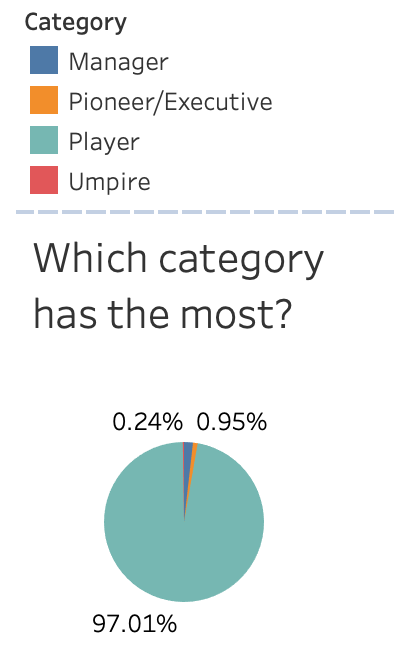
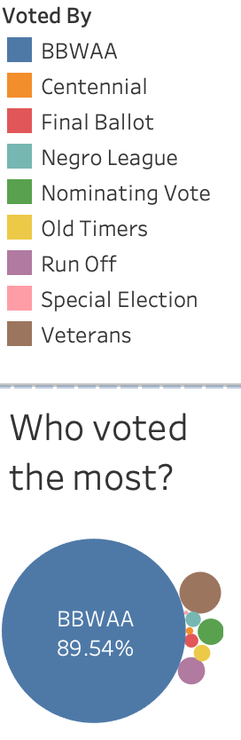
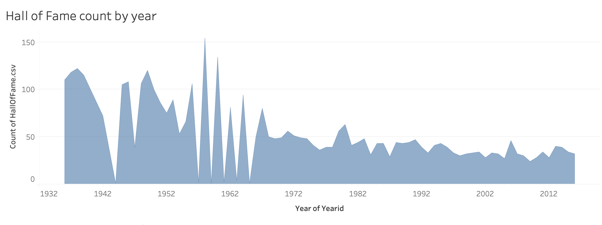
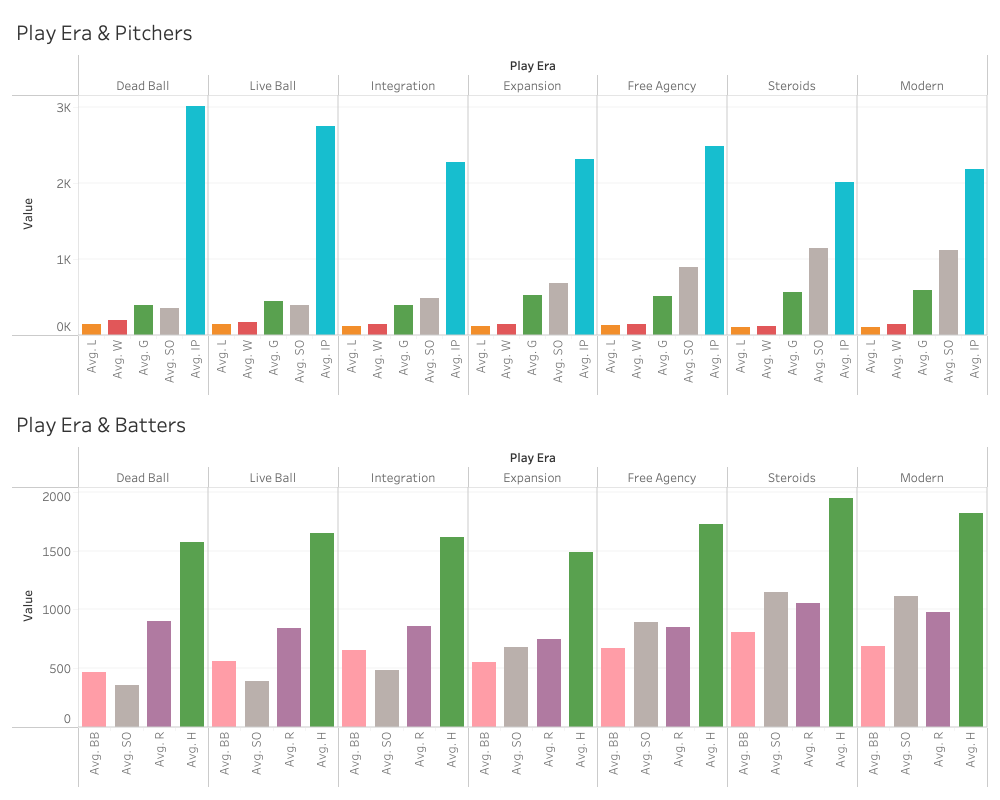

```{r setup, include=FALSE}
knitr::opts_chunk$set(echo = TRUE)
```

\begin{titlepage}
\centering

\huge \textbf{Baseball Hall of Fame Prediction}

\vspace{1cm}

\Large \textbf{STATS 140XP}

\vspace{1cm}

\Large \textbf{TEAM 2.1}

\vspace{1cm}

\textbf{Authors:}

Peter D. DePaul III\\ 
Nelson Duong\\ 
Jeffrey Gutierrez\\ 
Yuji Kusuyama\\ 
Alan Wong

\vspace{1cm}

\textbf{December 15, 2023}

\maketitle
\end{titlepage}


\tableofcontents

\newpage

# 1. Introduction

## 1.1 Background

The Baseball Hall of Fame, located in Cooperstown, New York, celebrates the achievements and history of baseball's most distinguished figures. Established in 1936, it serves as the pinnacle of recognition for players, managers, umpires, and executives. The process for a candidate's induction is rigorous. A player becomes eligible for Hall of Fame consideration once they have played at least 10 seasons, and been retired for 5 years. Eligibility then hinges on a vote by the Baseball Writers' Association of America (BBWAA), where a candidate must receive at least 75% of the votes to be inducted. A candidate will remain on the ballot for 10 years, unless the candidate receives less than 5% of the vote then they are dropped from future ballots. This threshold ensures that only the best of the best players make it into the Hall of Fame, while maintaining its prestige and significance in the baseball world.

In our endeavor to understand what distinguishes a Hall of Fame player from others, this report aims to dive deep into the statistical elements that might influence a player's induction into this esteemed institution. Utilizing the Sean 'Lahman' Baseball Database, which encompasses extensive records from 1871 to 2022, we analyze a wealth of data on players' performance. By analyzing statistics from players who have previously appeared on Hall of Fame ballots, our objective is to develop a predictive model that can forecast Hall of Fame induction based on career achievements and milestones in baseball.

The Lahman Baseball Database, pivotal to our analysis, is an extensive compilation of baseball statistics from 1871 to 2022. This database is renowned for its comprehensive coverage of baseball metrics, encompassing player performance across various aspects of the game. For our study, this database offers a rich repository of historical data, providing the foundation for our exploration into the statistical factors that influence Hall of Fame induction. The depth and breadth of the Lahman Database make it an invaluable resource for understanding the nuances and trends of baseball, allowing us to analyze players' careers in the context of different eras and changing dynamics of the sport.

## 1.2 Approach

Our methodology for this study is structured as a multi-step process, beginning with data cleaning and exploratory data analysis. This initial phase is critical for ensuring the integrity and quality of the data, involving comprehensive validation and cleaning procedures, followed by a preliminary analysis to understand the data's structure and key characteristics. The next phase, model building, entails the development of predictive models using the meticulously prepared data. After the models are built, they undergo a process of refinement. This refinement is guided by a series of assessment metrics, enabling us to iteratively improve the model's accuracy and reliability. The final phase of our methodology is model deployment. In this stage, the optimized model is applied to test data sets, and the results are interpreted in the context of our research objective. This final step also involves drawing conclusions and providing recommendations based on our findings, with an aim to contribute meaningful insights into the statistical factors influencing Hall of Fame inductions.

## 1.3 Paper Structure

This report is organized into several key sections, each designed to provide a comprehensive understanding of our analysis and findings. The Data Collection and Cleaning section details the initial phase of our project, focusing on the data collection process from the Sean 'Lahman' Baseball Database. It outlines the strategies employed for cleaning and preparing the data, ensuring its readiness for in-depth analysis. The Exploratory Data Analysis (EDA) section delves into the exploratory analysis of the data. This involves visualizing the data in various forms to uncover initial insights and patterns that will guide our subsequent model development. The Model Building and Refinement section describes the development and iterative refinement of our predictive models. It covers the methodologies and algorithms used, as well as the criteria for evaluating and enhancing the models' performance. The Results and Interpretation section presents the outcomes of our predictive models, including their accuracy and effectiveness in forecasting Hall of Fame inductions. We interpret these results in the context of the data set and our initial objectives. The Evaluation and Model Limitations part of the report assesses the overall performance of our models, discussing their strengths and limitations. It provides a critical evaluation of the models in light of the data and the complexities of predicting Hall of Fame inductions. The Conclusion and Recommendations section concludes the report with a summary of our findings, the implications of our study, and recommendations for future research. This section encapsulates the key insights gained and suggests avenues for further exploration in the realm of baseball analytics and Hall of Fame predictions. This structured approach ensures a logical flow of information, guiding the reader through the various stages of our research and analysis. Each section builds upon the previous, culminating in a comprehensive understanding of our study's objectives, methodologies, results, and implications.

# 2. Exploratory Data Analysis

## 2.1 Data Overview

Our analysis utilized a comprehensive data set sourced from the Sean Lahman Baseball Database. The database is comprised of 27 different data tables of various baseball statistics mostly sourced from Baseball-Reference. We utilized several of the data tables from the Lahman Database including "AwardsPlayers", "Batting", "Fielding", "FieldingOFSplit", "HallOfFame", "Pitching",and "People". 

"AwardsPlayers" include information about various Awards players have won, including their share of the vote won. "Batting" includes season-by-season standard batting statistics for each player. "Pitching" is the pitcher's equivalent to the "Batting" data table. "Fielding" includes standard fielding stats for all players, while "FieldingOFSplit" gives the specific breakdown of outfield position played (Left Field, Center Field, Right Field). "People" contains the general player information such as name, date of birth, and hometown. "HallOfFame" includes the Hall of Fame voting status for every person who has been a nominee on a ballot since 1936. 

It is important to note that reference to "Active" players in our context indicates the players have met the 10 season requirement for nomination but are still playing or have been retired less than five seasons.

## 2.2 Data Cleaning

The data cleaning process, a crucial step in our study, involved meticulous preparation of the data sourced from the Lahman Baseball Database. Initially, we divided the data, distinguishing between pitchers and batters to account for the distinct roles and statistical profiles inherent to these positions. This was followed by a detailed categorization process, where players were classified according to their specific roles within the game, such as starting pitchers, relievers for pitchers, and various fielding positions for batters. A significant part of the process entailed the aggregation of career statistics for both Hall of Fame inductees and active players. The culmination of this phase was the integration of these career statistics with the players' Hall of Fame voting results. This resulted in a comprehensive data set that provided a holistic view of each player's career, encompassing both their statistical achievements and their recognition in Hall of Fame voting. This data set served as the backbone for the ensuing exploratory data analysis and model building, laying a solid foundation for developing an insightful and accurate predictive model.

The active batting data, comprising 50 variables, provided an in-depth look into the batting performance of 179 active players. These variables encompassed a broad range of statistics, including but not limited to playerID, games played, at-bats, runs, hits, doubles, triples, home runs, runs batted in, bases on balls, and strikeouts. This data set was instrumental in analyzing the current trends and patterns in batting across the MLB.

Parallel to this, the Hall of Fame batting data set, also containing 50 variables, captured the historical batting performances of 826 players who have been nominees for the Hall of Fame. It mirrored the active batting data in terms of the variables covered, thereby allowing a comparative analysis between current players and those who have achieved the pinnacle of baseball recognition.

The active pitching data set included 44 variables across 160 observations. This data set was tailored to elucidate the nuances of active pitchers' careers, covering key metrics such as wins, losses, games played, games started, complete games, shutouts, hits allowed, earned runs, and home runs allowed.

Complementing this, the Hall of Fame pitching data set, with the same number of variables as the active pitching data set, detailed the career statistics of 432 pitchers who have been nominated for the Hall of Fame. This data set offered a historical perspective on pitching excellence in the MLB.

Together, these data sets provided a robust foundation for our analysis, offering a comprehensive view of players' performances, both current and historical, in the context of Hall of Fame induction.

## 2.3 Data Exploration

During the Exploratory Data Analysis (EDA) phase, our focus was to gain an insightful understanding of the Baseball Hall of Fame inductees and the voting patterns over the years. This phase was enriched by the use of various visualization techniques, each offering a unique perspective into the world of baseball and its historical evolution.

```{r, echo = FALSE, out.width = "75%", out.height="30%", fig.align='center'}

```

The first visualization we employed was a pie chart illustrating the distribution of Baseball Hall of Fame inductees by category. This chart revealed that a vast majority, 97.01%, of inductees are players, which aligns with the expectation as players are the most prominent and numerous participants in the sport. A comparatively smaller fraction, 0.95%, represented managers, and an even smaller segment, 0.24%, comprised umpires. The Pioneer/Executive category, although not explicitly shown in the pie chart, likely accounts for the remaining percentage, completing the 100% distribution. This visualization underscored the dominance of players in the Hall of Fame and provided a clear breakdown of the different categories of inductees.

```{r, echo = FALSE, out.width = "75%", out.height="30%", fig.align = "center"}

```

Another insightful visualization was a bubble chart showcasing the entities that have voted for Hall of Fame inductees. The sizes of the bubbles corresponded to the proportion of votes each entity held. The Baseball Writers' Association of America (BBWAA) was prominently featured with the largest bubble, accounting for 89.54% of the votes. This highlighted the BBWAA as the primary voting body for Hall of Fame candidates. In contrast, other voting entities like the Veterans Committee, various special committees, and historical overview committees (such as the Centennial, Negro League, Old Timers, etc.) had comparatively smaller roles in the voting process, as depicted by the smaller bubbles in the chart. This visualization provided a comprehensive view of the voting landscape, illustrating the weight and influence of different voting bodies in the induction process.

```{r, echo = FALSE, out.width = "75%", out.height="85%", fig.align = "center"}

```

We also analyzed the distribution of Hall of Fame nominees over time, starting from 1936. This time series visualization revealed fluctuations in the number of nominees per year, with notable peaks and troughs indicating years with particularly high or low numbers of nominees. The early years showed a surge in nominations, possibly due to efforts to honor many early baseball stars soon after the establishment of the Hall of Fame in 1936. A recent trend showed a decline in the number of nominees per year, potentially attributable to stricter voting criteria, fewer eligible candidates, or changes in the nomination and election processes.

```{r, echo = FALSE, out.width = "85%", out.height="60%", fig.align = "center"}

```

Furthermore, we created visualizations comparing the performance of batters and pitchers across the various eras of baseball. These eras include "Dead Ball", "Live Ball", "Integration", "Expansion", "Free Agency", "Steroids", and "Modern". These visualizations offered a comparative analysis of player statistics across different eras, with bars representing counts or specific measures like wins, strikeouts, home runs, hits, or batting averages. The use of different colors for subcategories within pitchers and batters enabled an easy comparison and understanding of how the game and player performances have evolved over time. These visualizations were instrumental in highlighting trends, impacts of rule changes, and the development of the game through different historical periods.

# 3. Model Building

## 3.1 Feature Engineering

The process began with feature engineering, where we focused on adding and refining variables to enhance the predictive power of our models. Key to this was the introduction of indicator variables representing significant career milestones such as 3,000 hits or 300 wins, acknowledging their historical importance in Hall of Fame considerations. Additionally, we incorporated rate statistics like Batting Average (BA), On Base Percentage (OBP), and On Base plus Slugging (OPS), providing a nuanced understanding of player performance beyond traditional counting statistics.

## 3.2 Pre-processing

Following feature engineering, we embarked on the data pre-processing stage. This crucial step involved removing irrelevant or redundant fields to streamline our data set. We then addressed missing values, employing techniques like bagging and the k-nearest neighbors algorithm to ensure data completeness and reliability. Normalization of the data was also carried out, standardizing it to a common scale to eliminate potential biases from varied scales of measurement. Lastly, we converted categorical data into numerical binary terms, preparing the data set for effective processing by our predictive models.

## 3.3 Building Candidate Models

The final step in our model building phase was the development of candidate models. We chose the Random Forest model for its capability to handle large data sets and its resilience against overfitting, thanks to its ensemble approach of combining multiple decision trees. Additionally, we opted for the Boosted Tree model using XGBoost, renowned for its efficiency and effectiveness in complex predictive tasks. The XGBoost model operates by sequentially improving upon the outputs of weaker decision trees. Both models were applied to both batting and pitching data, aiming to unravel the most significant statistical factors for Hall of Fame inductions. The selection of these specific models was influenced by their demonstrated success in similar analytical scenarios and their ability to extract meaningful patterns and relationships from the data.

## 3.4 Model Assessment

```{=tex}
\begin{center}
\textbf{Random Forest Batter's Model}
\end{center}

\begin{table}[ht]
\begin{minipage}{0.5\textwidth}
  \centering
  \begin{tabular}{|c|c|c|}
    \hline
    & \textbf{0} & \textbf{1} \\
    \hline
    \textbf{0} & 198 & 13 \\
    \hline
    \textbf{1} & 10 & 30 \\
    \hline
  \end{tabular}
  \caption{\textbf{Confusion Matrix}}
\end{minipage}
\begin{minipage}{0.5\textwidth}
  \centering
  \begin{tabular}{|l|r|}
    \hline
    \textbf{Metric} & \textbf{Value} \\
    \hline
    Accuracy & 0.9084 \\
    \hline
    Sensitivity & 0.6977 \\
    \hline
    Specificity & 0.9519 \\
    \hline
  \end{tabular}
  \caption{\textbf{Performance Metrics}}
\end{minipage}
\end{table}

\begin{center}
\textbf{Boosted Tree Batter's Model}
\end{center}

\begin{table}[ht]
\begin{minipage}{0.5\textwidth}
  \centering
  \begin{tabular}{|c|c|c|}
    \hline
    & \textbf{0} & \textbf{1} \\
    \hline
    \textbf{0} & 196 & 12 \\
    \hline
    \textbf{1} & 12 & 31 \\
    \hline
  \end{tabular}
  \caption{\textbf{Confusion Matrix}}
\end{minipage}
\begin{minipage}{0.5\textwidth}
  \centering
  \begin{tabular}{|l|r|}
    \hline
    \textbf{Metric} & \textbf{Value} \\
    \hline
    Accuracy & 0.9044 \\
    \hline
    Sensitivity & 0.7209 \\
    \hline
    Specificity & 0.9423 \\
    \hline
  \end{tabular}
  \caption{\textbf{Performance Metrics}}
\end{minipage}
\end{table}
```

```{r, echo = FALSE, out.width="50%"}
knitr::include_graphics(c("Images/Batter_rf_vip.png", "Images/Batter_boost_vip.png"))
```

For both our Batter's and Pitcher's model, we implemented 10-fold Cross Validation in order to provide a better understanding for our model performance on an independent data set. In the realm of batting statistics, our models showcased commendable predictive performance. The Random Forest model achieved a cross validation accuracy of 87.8%, with our testing model accuracy reaching 90.84%. This high level of accuracy indicates the model's robustness in identifying potential Hall of Fame inductees among batters based on their career statistics. The Boosted Tree model, using the XGBoost algorithm, demonstrated a similar level of proficiency, with a cross validation accuracy of 88.0% and a testing model accuracy of 90.44%. The consistency in these results across both models underscores the reliability of our predictive approach and the significance of the selected features. Notably, the feature importance analysis in both models highlighted 'Runs Scored (R)' as the most influential factor in predicting Hall of Fame induction for batters.

```{=tex}
\begin{center}
\textbf{Random Forest Pitcher's Model}
\end{center}

\begin{table}[ht]
\begin{minipage}{0.5\textwidth}
  \centering
  \begin{tabular}{|c|c|c|}
    \hline
    & \textbf{0} & \textbf{1} \\
    \hline
    \textbf{0} & 106 & 10 \\
    \hline
    \textbf{1} & 6 & 9 \\
    \hline
  \end{tabular}
  \caption{\textbf{Confusion Matrix}}
\end{minipage}
\begin{minipage}{0.5\textwidth}
  \centering
  \begin{tabular}{|l|r|}
    \hline
    \textbf{Metric} & \textbf{Value} \\
    \hline
    Accuracy & 0.8779 \\
    \hline
    Sensitivity & 0.4737 \\
    \hline
    Specificity & 0.9464 \\
    \hline
  \end{tabular}
  \caption{\textbf{Performance Metrics}}
\end{minipage}
\end{table}

\begin{center}
\textbf{Boosted Tree Pitcher's Model}
\end{center}

\begin{table}[ht]
\begin{minipage}{0.5\textwidth}
  \centering
  \begin{tabular}{|c|c|c|}
    \hline
    & \textbf{0} & \textbf{1} \\
    \hline
    \textbf{0} & 107 & 11 \\
    \hline
    \textbf{1} & 5 & 8 \\
    \hline
  \end{tabular}
  \caption{\textbf{Confusion Matrix}}
\end{minipage}
\begin{minipage}{0.5\textwidth}
  \centering
  \begin{tabular}{|l|r|}
    \hline
    \textbf{Metric} & \textbf{Value} \\
    \hline
    Accuracy & 0.8779 \\
    \hline
    Sensitivity & 0.4211 \\
    \hline
    Specificity & 0.9554 \\
    \hline
  \end{tabular}
  \caption{\textbf{Performance Metrics}}
\end{minipage}
\end{table}
```

```{r, echo = FALSE, out.width="50%"}
knitr::include_graphics(c("Images/pitcher_rf_vip.png", "Images/pitcher_boost_vip.png"))
```

For pitchers, the models yielded equally impressive results. The Random Forest model recorded a cross validation accuracy of 92.0%, with the testing model's accuracy being 87.79%. This indicates a strong capability of the model to discern Hall of Fame-worthy performances from regular ones based on pitching statistics. The Boosted Tree model paralleled this success, achieving a cross validation accuracy of 91.0% and a testing model accuracy of 87.79%. These results suggest a high level of precision in the models' predictions, reinforced by the identification of 'Wins' as a key variable influencing the likelihood of Hall of Fame induction for pitchers.

## 3.5 Model Evaluation

Upon evaluation, the models demonstrated a commendable prediction accuracy of around 90% for identifying potential Hall of Fame inductees among the Hall of Fame testing sets. This level of accuracy reflects the efficacy of our model design and the choice of features, which were pivotal in capturing the essence of Hall of Fame-worthy careers. The models' success in accurately forecasting Hall of Fame inductions provides valuable insights into the statistical patterns and trends that characterize the careers of baseball's most esteemed players.

Despite their high accuracy, the models exhibited certain limitations that warrant consideration. One notable limitation was the models' emphasis on counting statistics such as "Games Played (G)" over career averages such as "Batting Average (BA)". This could negatively influence predictions if there is a player who did not "accumulate" stats but produced at an efficient rate. Additionally, the lack of certain fielding statistics could have resulted in a less comprehensive view of players' overall contributions to the game. This is important for position such as Catcher, who frequently are great at defense and below-average hitters. These limitations highlight areas for future improvement. This suggests that incorporating a broader range of statistics, such as the impact of a stadium or league environment, could enhance the models' predictive capabilities and provide a more holistic assessment of players' Hall of Fame worthiness.

# 4. Conclusion

## 4.1 Recommendations

Our study's journey through data collection, exploratory analysis, and predictive modeling has culminated in a significant understanding of what statistical factors contribute to a player's induction into the Baseball Hall of Fame. Both the Random Forest and Boosted Tree models demonstrate high accuracy in predicting Hall of Fame inductions, highlighting the critical role of certain career statistics for batters and pitchers. For batters, 'Runs Scored' was pivotal, while for pitchers, 'Wins' emerged as the key indicator.

These findings underscore the profound impact of career-long achievements in shaping a player's legacy and their chances of being honored in the Hall of Fame. The models' success not only provides a statistical reflection of what constitutes a Hall of Fame-worthy career but also offers a data-driven perspective on the historical and contemporary trends in baseball.

## 4.2 Improvements

While our models have shown significant efficacy, they also reveal areas for potential enhancement. Future research could benefit from incorporating new advanced metrics, such as Wins Above Replacement (WAR) which helps compare players across eras. This expansion would not only address the current models' limitations but also potentially uncover new insights into the evolving nature of the game and its impact on player performance and recognition.

Moreover, with the ever-changing dynamics of baseball, including rule changes and the introduction of advanced metrics, ongoing updates and refinements to the models will be essential to maintain their relevance and accuracy.

In conclusion, our study represents a significant step forward in the analytics of baseball, particularly in understanding the Hall of Fame induction process. By harnessing the power of data and advanced analytics, we can gain deeper insights into the sport, celebrating its history while also looking forward to its future developments.
